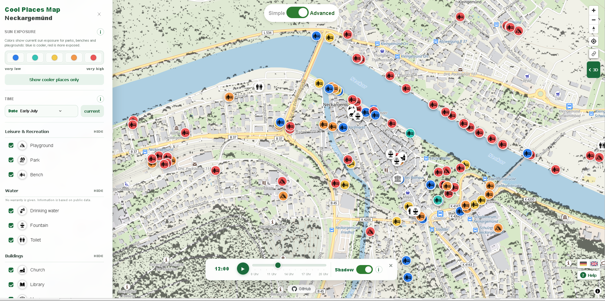

# Kühle-Orte-Karte Neckargemünd

Interaktive Webkarte zur Erkundung kühler und hitzeangepasster Orte in Neckargemünd. Die Karte verbindet öffentlich zugängliche Points of Interest (POIs) mit modellierten Informationen zu Sonnenbelastung und Schattenwurf.

**[Live-Demo öffnen](https://kfg-gis-2026.github.io/web-map/)**



## Über das Projekt

Die Kühle-Orte-Karte entstand im Rahmen eines Seminars an der Universität Heidelberg. Sie unterstützt dabei, Orte zu finden, die bei Hitze für Aufenthalt, Erholung oder Versorgung relevant sein können – beispielsweise Parks, Spielplätze, Sitzbänke, Trinkwasserstellen und öffentliche Gebäude.

Die Anwendung läuft vollständig im Browser. Sie benötigt keinen Build-Prozess und kein eigenes Backend. Karten- und Fachdaten werden zur Laufzeit von externen Diensten geladen.

## Funktionen

- Darstellung von Parks, Spielplätzen, Sitzbänken, Trinkwasserstellen, Brunnen, Toiletten, Kirchen, Büchereien und Museen
- Bewertung der Sonnenbelastung für Parks, Spielplätze und Sitzbänke
- Modellierter Schattenwurf für ausgewählte Referenztage von Mai bis September und Uhrzeiten von 08:00 bis 20:00 Uhr
- Einfache Ansicht für einen schnellen Überblick sowie komplexe Ansicht mit erweiterten Filtern
- Filterung nach POI-Kategorie und Sonnenbelastung
- Cluster-Darstellung bei kleineren Zoomstufen
- Adresssuche innerhalb Neckargemünds
- 3D-Gebäude und Standortbestimmung
- Teilbare Links zur aktuellen Kartenansicht
- Responsive Bedienung auf Desktop- und Mobilgeräten
- Deutsche und englische Benutzeroberfläche

> **Hinweis:** Sonnen- und Schattenwerte sind modellierte Näherungen für einen wolkenfreien Himmel. Alle Angaben erfolgen ohne Gewähr.

## Verwendete Technologien

- [MapLibre GL JS](https://maplibre.org/maplibre-gl-js/docs/) für die interaktive Kartendarstellung
- [PMTiles](https://docs.protomaps.com/pmtiles/) für die Bereitstellung der Schatten-Rasterdaten
- [OpenFreeMap](https://openfreemap.org/) als Basiskarte auf Grundlage von OpenStreetMap-Daten
- [OpenStreetMap Nominatim](https://nominatim.org/) für die Adresssuche
- HTML, CSS und JavaScript ohne Framework oder Build-Werkzeuge
- GitHub Pages für das Hosting
- GRASS GIS `r.sun` für die vorausgehende Modellierung der solaren Einstrahlung

## Lokale Entwicklung

### Voraussetzungen

- ein aktueller Webbrowser
- ein lokaler Webserver, zum Beispiel die VS-Code-Erweiterung **Live Server** oder Python 3
- eine Internetverbindung zum Laden der Basiskarte, Bibliotheken und Geodaten

### Projekt starten

Repository klonen und in den Projektordner wechseln:

```bash
git clone https://github.com/KFG-GIS-2026/web-map.git
cd web-map
```

Anschließend eine der folgenden Möglichkeiten verwenden.

**Mit VS Code und Live Server**

1. Den Ordner in VS Code öffnen.
2. `index.html` auswählen.
3. **Open with Live Server** starten.

**Mit Python**

```bash
python -m http.server 8000
```

Danach die Anwendung unter [http://localhost:8000](http://localhost:8000) öffnen.

Ein lokaler Webserver ist erforderlich, da Browser das Laden externer Karten- und Geodaten beim direkten Öffnen über `file://` einschränken können.

## Projektstruktur

```text
web-map/
├── index.html                 # HTML-Grundgerüst und Bedienelemente
├── Readme.md                  # Projektdokumentation
├── src/
│   ├── css/
│   │   └── style.css          # Layout und responsives Design
│   └── js/
│       ├── boundary.js        # Hilfsfunktionen für die Stadtgrenze
│       ├── config.js          # Datenquellen, Kategorien und Konfiguration
│       ├── help.js            # Hilfe-Dialog
│       ├── i18n.js            # Deutsche und englische Übersetzungen
│       ├── map.js             # Karteninitialisierung und zentrale Steuerung
│       ├── pois.js            # POIs, Marker, Pop-ups, Filter und Cluster
│       └── shadow.js          # Schattenebene, Datum und Zeitanimation
├── analysis/
│   └── solarwerte/csv/        # Analyse- und Solarwerttabellen
└── docs/
    └── images/                # Bilder für die Dokumentation
```

## Daten und Konfiguration

Die Anwendung trennt Programmcode und Geodaten. POIs, Symbole, Stadtgrenze und Schattenkacheln liegen im separaten Repository **[web-map-data](https://github.com/KFG-GIS-2026/web-map-data)** und werden über GitHub Pages geladen.

Zentrale Einstellungen befinden sich in [`src/js/config.js`](src/js/config.js):

- `MAP_STYLE` legt den verwendeten Kartenstil fest.
- `DATA_BASE_URL` verweist auf das externe Daten-Repository.
- `POI_CATEGORIES` definiert Kategorien, GeoJSON-Dateien, Symbole und Farben.
- `SHADOW_COORDS` und `SHADOW_MIN_ZOOM` steuern die räumliche Darstellung der Schattendaten.

Neue POI-Kategorien müssen sowohl in `POI_CATEGORIES` als auch in den zugehörigen Filter- und Übersetzungselementen ergänzt werden. Die GeoJSON-Daten müssen Punktgeometrien im Koordinatensystem WGS 84 enthalten.

## Deployment

Da es sich um eine statische Website handelt, kann das Projekt direkt über GitHub Pages veröffentlicht werden:

1. In den Repository-Einstellungen **Pages** öffnen.
2. Unter **Build and deployment** die Veröffentlichung aus einem Branch wählen.
3. Den gewünschten Branch und den Ordner `/ (root)` auswählen.

Nach Änderungen kann es einige Minuten dauern, bis GitHub Pages die aktualisierte Version ausliefert.

## Datenquellen und Lizenzen

Die Basiskarte und ein Teil der POI-Daten basieren auf [OpenStreetMap](https://www.openstreetmap.org/copyright) und unterliegen der Open Data Commons Open Database License (ODbL). Für weitere Daten, Bibliotheken und Kartendienste gelten die jeweiligen Nutzungs- und Lizenzbedingungen der Anbieter.

Für den Quellcode dieses Repositorys ist derzeit keine separate Lizenzdatei hinterlegt. Ohne eine ausdrückliche Softwarelizenz werden keine weitergehenden Nutzungsrechte eingeräumt.

## Mitwirken

Hinweise, Fehlerberichte und Verbesserungsvorschläge können über die [GitHub Issues](https://github.com/KFG-GIS-2026/web-map/issues) eingereicht werden. Änderungen sollten möglichst in einem eigenen Branch umgesetzt und anschließend als Pull Request vorgeschlagen werden.
